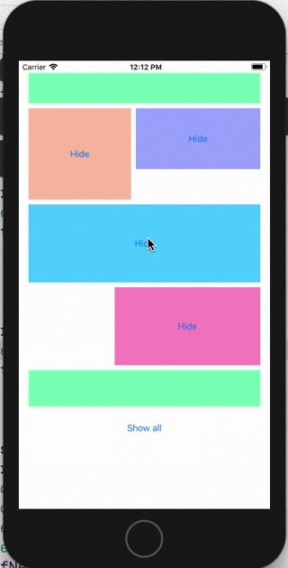

# SHView
SHView is a view with gone property.

## Features

- Just setGone -- view will disapear.
- Automatically adjust constaraints height.
- Automatically adjust margens.

## SHView in Action 

- Stroyboard Implementation

  


- Simulator
  
  

## Demo

[Demo on Appetize.io](https://appetize.io/app/qvxzbzh55uzxwawpc63mrq0abg?device=iphone6s&scale=75&orientation=portrait&osVersion=11.4)




## Example

```swift
let myView = SHView()
```
add your constraints

```swift
myView.gone = true
```
or
```swift
myView.gone = false
```
